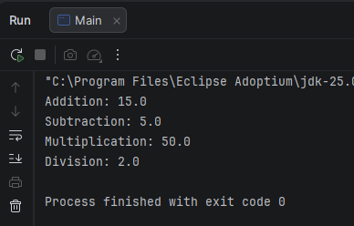
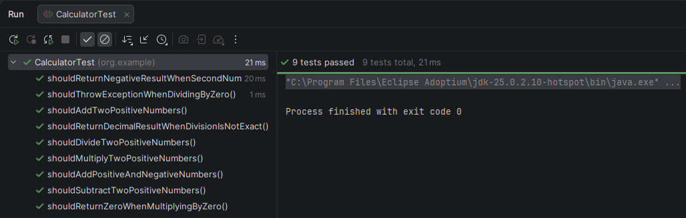

<a id="readme-es"></a>

# 🧮 Calculadora - TDD - Java


**Idioma:** **Español** | [English](./README.en.md#readme-en)

**Navegación rápida**

- [Descripción](#descripcion)
- [Estructura del proyecto](#estructura-del-proyecto)
- [Main / Calculator / CalculatorTest](#roles-del-proyecto)
- [Cómo ejecutar el proyecto](#como-ejecutar-el-proyecto)
- [Metodología TDD aplicada](#metodologia-tdd-aplicada)
- [Ir a la versión en inglés](./README.en.md#readme-en)

**Misma navegación en inglés**

- [Description](./README.en.md#description)
- [Project Roles](./README.en.md#project-roles)
- [How to Run the Project](./README.en.md#how-to-run-the-project)
- [Applied TDD Methodology](./README.en.md#applied-tdd-methodology)

---

<a id="descripcion"></a>

## 📘 Descripción

 

**Calculadora - TDD - Java** es una calculadora simple desarrollada en **Java Vanilla** siguiendo una metodología de **TDD real (Test-Driven Development)**. El proyecto está organizado en torno a tres piezas muy definidas: `Calculator`, que concentra la lógica matemática; `Main`, que ejecuta el programa y muestra resultados por consola; y `CalculatorTest`, que valida el comportamiento esperado mediante pruebas unitarias.

Su alcance es intencionalmente claro: demostrar una implementación pequeña, limpia y profesional de operaciones aritméticas básicas, con una estructura mantenible y alineada con buenas prácticas de diseño.

---

## ⚙️ Tecnologías utilizadas

 

- Java 25
- Maven
- Maven Wrapper (`mvnw` y `mvnw.cmd`)
- JUnit 5
- IntelliJ IDEA 2025
- Git
- GitHub

---

<a id="estructura-del-proyecto"></a>

## 🗂️ Estructura del proyecto

 

```text
calculadora-tdd-java/
|-- .mvn/
|   `-- wrapper/
|-- assets/
|   `-- img/
|       |-- CalculatorPantalla.png
|       `-- CalculatorTest.png
|-- src/
|   |-- main/
|   |   |-- java/
|   |   |   `-- org/
|   |   |       `-- example/
|   |   |           |-- Calculator.java
|   |   |           `-- Main.java
|   |   `-- resources/
|   `-- test/
|       `-- java/
|           `-- org/
|               `-- example/
|                   `-- CalculatorTest.java
|-- mvnw
|-- mvnw.cmd
|-- pom.xml
|-- README.md
`-- README.en.md
```

La presencia de `.mvn/`, `mvnw` y `mvnw.cmd` permite ejecutar Maven con el wrapper del proyecto, sin depender de una instalación global para compilar o lanzar tests.

---

<a id="roles-del-proyecto"></a>

## 🧩 Main / Calculator / CalculatorTest

 

La separación entre clases es deliberada y forma parte del valor didáctico del proyecto:

| Archivo | Rol | Responsabilidad |
| --- | --- | --- |
| `src/main/java/org/example/Main.java` | Punto de entrada | Ejecuta un ejemplo simple por consola y enseña cómo consumir la calculadora. |
| `src/main/java/org/example/Calculator.java` | Lógica de negocio | Implementa `add`, `subtract`, `multiply` y `divide`, incluyendo la validación de división por cero. |
| `src/test/java/org/example/CalculatorTest.java` | Especificación ejecutable | Define el comportamiento esperado con pruebas unitarias y protege la lógica ante regresiones. |

Esta división deja claro qué parte demuestra el uso (`Main`), qué parte resuelve el problema (`Calculator`) y qué parte garantiza el comportamiento (`CalculatorTest`).

---

## 🚀 Funcionalidades implementadas

 

La clase `Calculator` expone cuatro métodos públicos para operar con valores `double`:

- `add(double firstNumber, double secondNumber)`: realiza la suma de dos números.
- `subtract(double firstNumber, double secondNumber)`: calcula la resta entre el primer valor y el segundo.
- `multiply(double firstNumber, double secondNumber)`: devuelve el producto de ambos valores.
- `divide(double firstNumber, double secondNumber)`: ejecuta la división y valida que el divisor no sea cero.

### 🧠 Comportamiento implementado

 

La calculadora realiza operaciones matemáticas a partir de los valores recibidos por cada método y devuelve resultados correctos con números positivos, negativos y cero. La implementación contempla tanto divisiones exactas como divisiones con resultado decimal, y protege el caso de división por cero mediante el lanzamiento de una `IllegalArgumentException`, evitando comportamientos incorrectos en tiempo de ejecución.

---

## 💻 Ejecución del programa

 

La clase `Main` crea una instancia de `Calculator`, define dos valores de ejemplo (`10` y `5`) y muestra por consola el resultado de las cuatro operaciones principales.

**Salida esperada:**

```text
Addition: 15.0
Subtraction: 5.0
Multiplication: 50.0
Division: 2.0
```

### 🖼️ Evidencia




---

## 🧪 Tests

 

El proyecto incluye pruebas unitarias con **JUnit 5** para verificar el comportamiento de cada operación y asegurar que la lógica de negocio responde correctamente ante escenarios normales y casos límite.

### ✅ Casos cubiertos

 

- suma con números positivos
- suma con positivo y negativo
- resta con resultado positivo
- resta con resultado negativo
- multiplicación con números positivos
- multiplicación por cero
- división con resultado exacto
- división con resultado decimal
- división por cero con excepción esperada

### 🖼️ Evidencia




---

<a id="metodologia-tdd-aplicada"></a>

## 🔁 Metodología TDD aplicada

 

El desarrollo de este proyecto sigue el flujo clásico de **TDD real**, aplicando un ciclo corto y controlado para cada funcionalidad:

1. Escribir primero el test que define el comportamiento esperado.
2. Ejecutar la prueba y comprobar que falla.
3. Implementar la solución mínima necesaria para hacerla pasar.
4. Volver a ejecutar los tests para validar el cambio.
5. Refactorizar si procede, manteniendo el comportamiento verificado.

Este enfoque favorece un código más fiable, con feedback rápido y una evolución guiada por requisitos observables.

### 🔴🟢♻️ Red -> Green -> Refactor en este repositorio

  

- **Red**: `CalculatorTest` define primero qué debe ocurrir, por ejemplo cuando una división por cero debe lanzar una excepción.
- **Green**: `Calculator` incorpora solo la lógica mínima necesaria para que ese test pase.
- **Refactor**: con la suite en verde, el código puede limpiarse sin miedo a romper el comportamiento ya cubierto.

En este proyecto, `Main` no dirige el diseño de la lógica. El diseño nace desde los tests y `Main` queda como demostración de uso, no como especificación del comportamiento.

### 📈 Qué aporta TDD aquí

 

- convierte cada requisito en una prueba repetible;
- reduce regresiones al modificar la lógica de `Calculator`;
- obliga a mantener responsabilidades pequeñas y fáciles de validar;
- hace visible la relación entre comportamiento esperado e implementación.

---

## 🧱 Principios SOLID aplicados

 

En este proyecto se aplica de forma clara el **Single Responsibility Principle (SRP)**:

- `Calculator` tiene una única responsabilidad: realizar operaciones matemáticas.
- `Main` tiene una única responsabilidad: ejecutar el flujo de ejemplo e imprimir resultados.
- `CalculatorTest` tiene una única responsabilidad: validar que el comportamiento implementado es correcto.

Esta separación mantiene el código simple de entender, fácil de extender y cómodo de probar.

---

## 🏷️ Naming y buenas prácticas

 

El proyecto utiliza un **naming claro, limpio y profesional**, orientado a que cada clase, método y variable exprese su intención sin ambigüedad. Nombres como `Calculator`, `Main`, `CalculatorTest`, `firstNumber`, `secondNumber`, `add`, `subtract`, `multiply` y `divide` reflejan exactamente su propósito y facilitan la lectura del código.

Además, la estructura es coherente con una base Java sencilla: responsabilidades bien delimitadas, tests separados del código productivo y una organización que favorece mantenibilidad y comprensión inmediata.

---

<a id="como-ejecutar-el-proyecto"></a>

## ▶️ Cómo ejecutar el proyecto

 

Puedes ejecutar el proyecto de dos formas habituales:

### 💡 Desde IntelliJ IDEA 2025

 

- Abre el proyecto como proyecto Maven.
- Verifica que el SDK configurado sea **JDK 25**, porque `pom.xml` compila con `source` y `target` en `25`.
- Ejecuta `src/main/java/org/example/Main.java` para ver la salida por consola.
- Ejecuta `src/test/java/org/example/CalculatorTest.java` para lanzar la batería de pruebas.
- También puedes usar la ventana Maven de IntelliJ para ejecutar la fase `test`.

Si quieres lanzar la clase principal desde IntelliJ, basta con usar la opción `Run 'Main.main()'` sobre `Main.java`.

### 🖥️ Desde terminal con Maven Wrapper

 

El wrapper es la opción recomendada porque el repositorio ya incluye `mvnw`, `mvnw.cmd` y `.mvn/wrapper`.

**Windows**

```powershell
.\mvnw.cmd test
.\mvnw.cmd clean package
java -cp target/classes org.example.Main
```

**macOS / Linux**

```bash
./mvnw test
./mvnw clean package
java -cp target/classes org.example.Main
```

Si `mvnw` no tiene permisos de ejecución:

```bash
chmod +x mvnw
```

### ⌨️ Desde terminal con Maven instalado globalmente

 

También puedes usar Maven directamente si ya lo tienes instalado en tu sistema:

```bash
mvn test
mvn clean package
java -cp target/classes org.example.Main
```

---

## 👨‍💻 Autor

 

**David Navarro**

---

## 🌐 Navegación entre idiomas

 

- Inicio en español: [README.md](#readme-es)
- README en inglés: [README.en.md](./README.en.md#readme-en)
- Ejecución en inglés: [How to Run the Project](./README.en.md#how-to-run-the-project)
- TDD en inglés: [Applied TDD Methodology](./README.en.md#applied-tdd-methodology)
